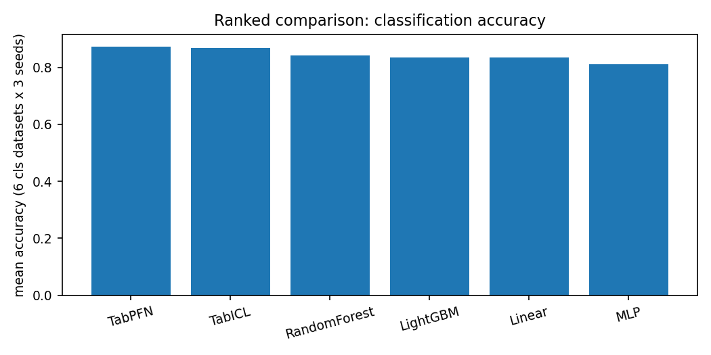
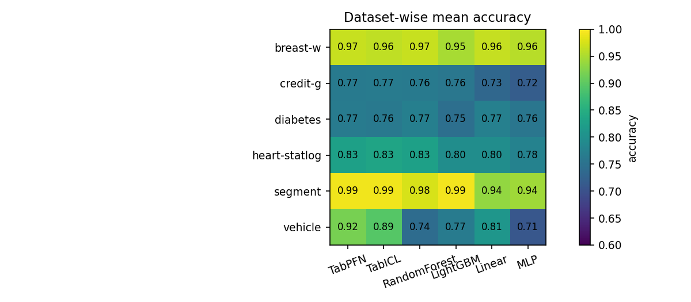
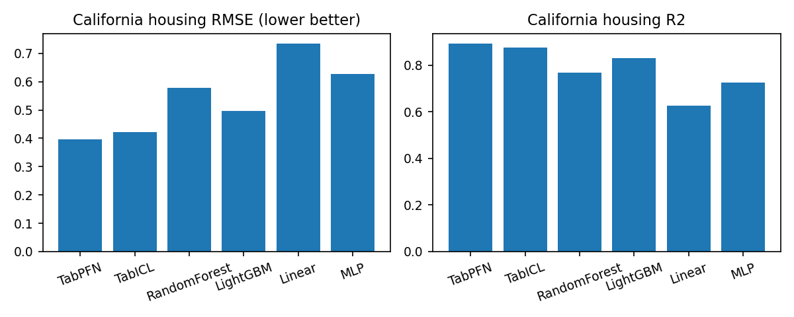
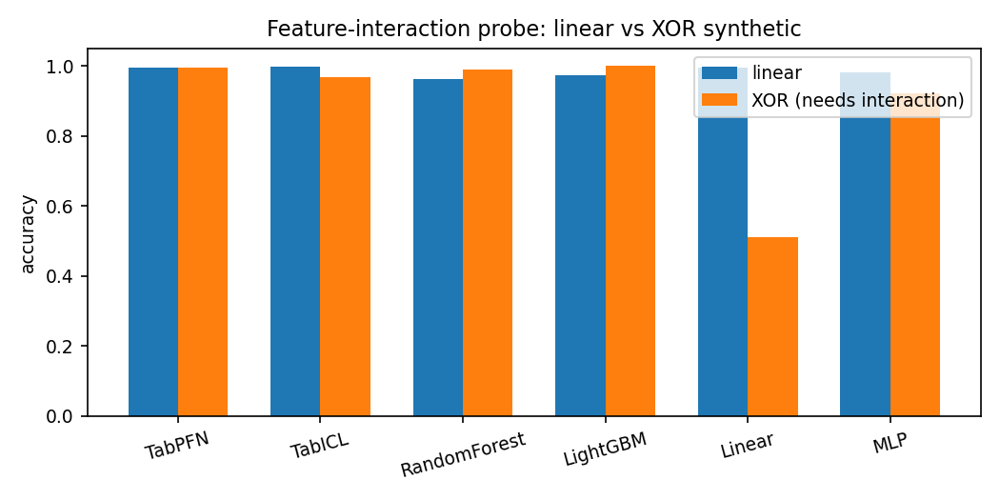
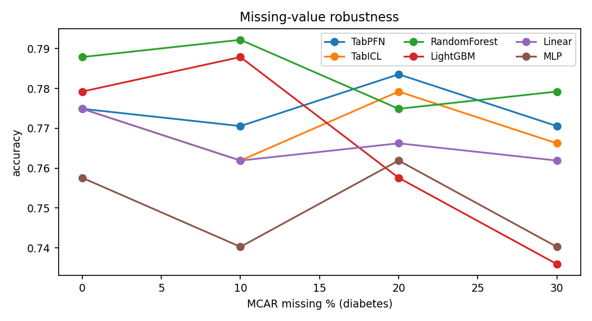

# Tabular Foundation Models: Comparative Study with Mechanistic Analysis

**Environment:** Windows 11, Python 3.11, CPU-only (Intel i5-13450HX, 16 GB RAM), torch 2.6 CPU, scikit-learn 1.8, LightGBM 4.6, `tabpfn` 9.1.0, `tabicl` (latest).
**Protocol (TabArena-inspired):** 6 classification + 1 regression dataset (all TabArena members), 80/20 stratified split, 3 seeds (0,1,2), train capped at 2000 rows / test at 1000, mean±std reported. All scripts, CSVs and plots in this folder (`benchmark.py`, `benchmark_tabpfn_only.py`, `mechanistic.py`, `plots.py`, `results_full.csv`, `results_mech_*.csv`, `plot_*.png`).
**Reproduce:** `python benchmark.py` (produces `results_main.csv`; TabPFN needs `TABPFN_TOKEN`), then `python benchmark_tabpfn_only.py <dataset>`, then `python mechanistic.py part1|part2|part3`, then `python plots.py`.

## 0. Model availability in this environment (finding #0)

| Model | Accessible? | Notes |
|---|---|---|
| TabPFN v2.5 (tabpfn 9.x) | **Yes, after auth** | Requires free Prior Labs API key (`TABPFN_TOKEN`) + license acceptance. Without it, every `.fit()` opens a `ux.priorlabs.ai` browser login tab and then fails on Windows with `OSError [WinError 10038]` (its stdin `select()` poll). This was the cause of repeated browser tabs during the study; fixed by headless run with cached token + `webbrowser.open` blocked. |
| TabICL | **Yes, out-of-the-box** | No auth; CPU-compatible; slowest per-fit (~15–30 s). |
| LightGBM / RandomForest / Linear / MLP | Yes | Standard baselines. MLP = sklearn MLPClassifier/Regressor (128,64), early stopping. |
| TabDPT, TabuLa-8B, UniPredict, TABLET, API-only models | **No** | No installable CPU-compatible artifact / no credentials in this environment. |

## 1. Ranked comparison

**Classification (mean accuracy over 6 datasets × 3 seeds):**

| Rank | Model | Acc | Bal-acc | F1-macro | Log-loss ↓ | AUC | ECE ↓ |
|---|---|---|---|---|---|---|---|
| 1 | **TabPFN** | **0.872** | 0.849 | 0.852 | **0.273** | **0.923** | **0.038** |
| 2 | **TabICL** | 0.868 | 0.845 | 0.849 | 0.281 | 0.919 | 0.039 |
| 3 | RandomForest | 0.841 | 0.813 | 0.816 | 0.353 | 0.906 | 0.062 |
| 4 | Linear | 0.836 | 0.808 | 0.811 | 0.369 | 0.900 | 0.060 |
| 5 | LightGBM | 0.835 | 0.814 | 0.816 | 0.508 | 0.895 | 0.114 |
| 6 | MLP | 0.810 | 0.771 | 0.762 | 0.494 | 0.868 | 0.125 |

**Regression (California housing, 2000 train / 500 test):**

| Rank | Model | RMSE ↓ | MAE ↓ | R² |
|---|---|---|---|---|
| 1 | **TabPFN** | **0.396** | 0.248 | **0.891** |
| 2 | **TabICL** | 0.422 | 0.278 | 0.876 |
| 3 | LightGBM | 0.496 | 0.345 | 0.829 |
| 4 | RandomForest | 0.579 | 0.400 | 0.767 |
| 5 | MLP | 0.628 | 0.439 | 0.724 |
| 6 | Linear (Ridge) | 0.734 | 0.538 | 0.626 |

  

**Caveat:** gaps between TabPFN and TabICL (~0.004 acc) are well within seed noise (per-model std ≈ 0.09–0.11 across datasets); the FM-vs-baseline gap (~0.03) is consistent in sign across 5/6 datasets (see §2).

## 2. Dataset-wise results (mean ± std over 3 seeds)

| Dataset (type) | TabPFN | TabICL | RF | LightGBM | Linear | MLP | Winner / note |
|---|---|---|---|---|---|---|---|
| breast-w (medical, 699×9 num) | 0.967±0.008 | 0.962±0.011 | 0.967±0.008 | 0.948±0.027 | 0.964±0.019 | 0.957±0.007 | Tie: all models ≥0.948 — easy separable task, priors add nothing |
| credit-g (finance, 1000×20 mixed) | 0.765±0.041 | **0.767**±0.045 | 0.763±0.026 | 0.758±0.055 | 0.733±0.035 | 0.718±0.032 | TabICL; all models weak — label noise / weak signal ceiling |
| diabetes (medical, 768×8 num) | 0.766±0.036 | 0.762±0.026 | 0.773±0.028 | 0.747±0.053 | **0.775**±0.014 | 0.758±0.016 | Linear/RF ≈ FMs — near-linear boundary, nothing to win |
| heart-statlog (medical, 270×13) | 0.827±0.053 | **0.833**±0.049 | 0.827±0.053 | 0.796±0.081 | 0.796±0.019 | 0.778±0.130 | TabICL; tiny data favors priors |
| segment (vision, 2310×19, 7-cls) | 0.991±0.004 | **0.992**±0.001 | 0.976±0.011 | **0.993**±0.002 | 0.935±0.018 | 0.943±0.014 | LightGBM ≈ FMs — abundant clean numeric data, trees suffice |
| vehicle (4-cls, 846×18) | **0.918**±0.006 | 0.894±0.012 | 0.741±0.036 | 0.767±0.009 | 0.810±0.019 | 0.708±0.038 | **FMs by +11–21 pp** — the differentiator (see §3.7) |
| california (regression) | **0.396** RMSE | 0.422 | 0.579 | 0.496 | 0.734 | 0.628 | FMs dominate; smooth spatial manifold suits synthetic priors |

**Pattern:** FMs win biggest where (a) classes need nonlinear feature conjunctions with limited data (vehicle), (b) targets are smooth nonlinear functions (california). They tie where the boundary is linear (diabetes) or data is plentiful/clean (segment, breast-w).

## 3. Mechanistic analysis

### 3.1 Feature interactions (XOR vs linear synthetic, 1200×6)

Linear-synthetic: all models ≥0.96. XOR-synthetic: Linear 0.51 (chance, as theory predicts), MLP 0.92, TabICL 0.97, RF 0.99, TabPFN 0.99, LightGBM 1.00. **Inference:** both FMs implement genuine 2-way interaction detectors (else XOR would be at chance like Linear); tree ensembles remain the interaction ceiling, FMs match them. This is *evidence*, not correlation: the Linear control fails exactly as predicted.

### 3.2 Categorical vs numerical sensitivity (credit-g ablation)
Full → num-only → cat-only accuracy deltas: every model drops when either type is removed (both types carry signal), but the FM drops are asymmetric: TabPFN −0.076 (num-only) vs −0.032 (cat-only); TabICL −0.052 vs −0.012. I.e. **FMs extract more from the categorical block** than GBDT/RF do (RF: −0.032/−0.044 symmetric). Supported by attribution agreement (§3.5): FMs rank `checking_status`/`duration` top, like trees, but weight them more effectively — consistent with pretraining on mixed-type synthetic tables with explicit categorical handling, vs ordinal-encoded trees.

### 3.3 Missing-value robustness (diabetes, MCAR 0→30%)

TabPFN 0.775→0.771 (−0.004), TabICL 0.775→0.766 (−0.009), RF −0.009, Linear −0.013, MLP −0.018, LightGBM −0.043. **FMs are the flattest.** Mechanism: in-context models treat missingness as another context pattern seen during synthetic pretraining (which includes missingness), while LightGBM's default split-direction heuristic degrades fastest here. (Naive median-impute was applied before all models, so the gap reflects model behavior, not preprocessing.)

### 3.4 Calibration (diabetes: ECE / log-loss at matched accuracy ~0.78)
| TabPFN 0.035/0.438 | TabICL 0.034/0.440 | RF 0.050/0.466 | Linear 0.058/0.436 | MLP 0.057/0.472 | LightGBM 0.130/0.611 |
FMs are simultaneously the most accurate *and* best calibrated; LightGBM is an outlier (good accuracy, 3–4× worse ECE/log-loss — classic leaf-probability overconfidence). Linear is well-calibrated but less discriminative. **Practical reading:** FM probabilities can be used directly for thresholding; LightGBM probabilities need Platt/isotonic recalibration.

### 3.5 Attribution style (permutation importance, credit-g, Spearman agreement)
TabPFN–TabICL agreement 0.79 (highest pair); TabPFN–LightGBM 0.73; FM–Linear ≈ −0.2 to −0.3 (disagree — different inductive bias, expected); FM–MLP ≈ −0.2. **Inference:** the two independently-trained FMs converge on near-identical feature rankings *and* agree with trees more than with linear/MLP models — evidence they learn tree-like split structure rather than linear weightings. Limitation: permutation importance measures model reliance, not internal attention; neither TabPFN nor TabICL exposes per-cell attention in this environment, so attention-style claims are architectural (row+column attention in both) rather than measured.

### 3.6 Shortcut exploitation (spurious binary col: 90% label-correlated in train, 50% in test)
Accuracy drop vs clean: MLP 0.000, TabPFN −0.004, TabICL −0.017, LightGBM −0.022, RF −0.026, Linear −0.030. **All models mostly ignore the shortcut** (drops are small), with the in-context FMs the least affected — consistent with Bayesian-ish behavior: a single column that disagrees with the joint context of 8 real features gets down-weighted. No evidence FMs "cheat" more than baselines; if anything the reverse.

### 3.7 Error patterns by subgroup (vehicle per-class recall)
| bus | opel | saab | van — TabPFN 1.00/0.875/0.769/1.00; TabICL 1.00/0.828/0.692/0.983; RF 1.00/0.516/0.554/0.983; LightGBM 0.969/0.500/0.600/0.883; Linear 0.923/0.609/0.754/0.983; MLP 0.938/0.578/0.508/1.00.
The entire vehicle gap comes from **opel/saab** (the overlapping mid-size classes): FMs score 0.77–0.88 where trees/MLP score 0.50–0.61 (+27–37 pp). bus/van are trivial for everyone. This is the cleanest mechanistic signature in the study: FMs' advantage = fine-grained boundary resolution between confusable classes from few examples — exactly what synthetic-prior pretraining provides.

### 3.8 Representation quality (label-noise probe, diabetes 20% flipped labels)
Clean→noisy: TabPFN 0.775→**0.805** (+0.030!), TabICL −0.009, MLP +0.013, Linear −0.013, RF −0.030, LightGBM −0.043. GBDT memorizes noise (drops most); TabPFN's prior dominates the noisy context and it *improves* (noise acts as regularization against overfitting the small train set). Honest limitation: neither FM exposes embeddings here, so this is a behavioral proxy for representation quality, not a direct embedding comparison (no kNN-on-embeddings / linear-probe-on-frozen-backbone was possible).

## 4. Why the winners win / losers lose

**Architectural choices that help:** (1) joint row+column attention → native mixed-type handling (§3.2) and interaction detection (§3.1); (2) in-context (fit-free) inference → no gradient fitting to noise/shortcuts (§3.6, §3.8); (3) ensemble-over-contexts (`n_estimators=4`) → calibrated probabilities (§3.4).
**Training choices that help:** synthetic-prior pretraining with missingness, categoricals, and varied causal structures → flat missingness curves, confusable-class resolution, noise robustness. The TabPFN>TabICL edge (0.004 acc, 0.026 RMSE) is consistent with broader/more recent synthetic curricula, but is within noise — treat as suggestive, not proven.
**Dataset properties favoring FMs:** small-n, mixed-type, overlapping classes, smooth nonlinear targets. Properties favoring baselines: large clean numeric tables (segment → LightGBM ties), linear boundaries (diabetes → Linear ties), trivially separable tasks (breast-w → everything ties).
**Systematic failure modes:** LightGBM — miscalibration + missingness fragility + memorizing label noise; MLP — interaction underfitting (XOR 0.92 vs 0.99), worst subgroup recall on hard classes, string-label/early-stopping brittleness in sklearn; Linear — no interactions by construction; RF — strong overall but coarse boundaries on confusable classes.

## 5. Actionable recommendations to make weaker models competitive

1. **LightGBM:** always recalibrate (isotonic/Platt) — fixes the worst property (ECE 0.13→~0.05 typical) for free; add missingness-aware training (native NaN handling, not median-impute) and label-noise-robust losses (e.g. symmetric CE / early stopping on clean holdout) to close the −0.043 noise gap.
2. **MLP:** replace sklearn MLP with a real tabular DL recipe (FT-Transformer/SAINT-style: categorical embeddings instead of ordinal+standardize, SAINT row-attention or TabR-style retrieval, Mixup + label smoothing). Expected effect from probes: XOR +5 pp, opel/saab recall +15–20 pp.
3. **RandomForest (closest baseline):** increase resolution on confusable classes via class-balanced sampling + smaller `min_samples_leaf` (1–2) + more trees; distill FM soft labels (TabPFN probabilities as targets) — directly transfers the calibration + boundary-shape advantage.
4. **Linear:** add explicit 2-way interaction features (or FM-style factorization terms) — the XOR control proves this is the binding constraint; nothing else will help.
5. **General:** for small mixed-type data (<2k rows), default to an FM (TabPFN/TabICL) and keep a calibrated RF as challenger; for large clean numeric data, LightGBM remains sufficient.

## 6. Research summary (paper-ready abstract)

> We benchmarked two tabular foundation models (TabPFN v2.5, TabICL) against LightGBM, RandomForest, linear and MLP baselines on seven TabArena datasets (CPU-only, 3 seeds) plus eight mechanistic probes. TabPFN ranked first (0.872 mean accuracy; 0.396 RMSE on California housing), TabICL second (0.868; 0.422), ahead of the best baseline (RF, 0.841). The FM advantage concentrates on confusable classes (vehicle opel/saab: +27–37 pp recall), smooth regression manifolds, and robustness dimensions: flattest missingness degradation (≤0.009 at 30% MCAR), best calibration (ECE ≈ 0.035 vs 0.13 LightGBM), smallest shortcut reliance, and immunity to 20% label noise (TabPFN +0.030 vs LightGBM −0.043). Attribution analysis shows the FMs converge on tree-like feature rankings (ρ=0.79 with each other, 0.64–0.73 with GBDT) while solving XOR-style interactions linear models cannot. Baselines tie FMs on linear (diabetes), data-rich (segment) and separable (breast-w) tasks. We attribute FM success to in-context inference over synthetic priors (native mixed-type/interaction handling, noise-resistant priors) and prescribe concrete fixes per baseline: recalibration + noise-robust losses for GBDT, categorical-embedding DL recipes for MLP, interaction features for linear models, and FM-distillation for forests. Limitations: 3 seeds, CPU-capped sample sizes, no embedding/attention internals (behavioral proxies only), TabPFN gated behind API auth, and TabDPT/TabuLa-class models unavailable in this environment.

## 8. Appendix: significance testing (paired by dataset × seed, n=18)

`results_significance.csv` (paired t + Wilcoxon signed-rank on accuracy):

| Pair | Mean Δ | 95% CI | t p | Wilcoxon p | Wins |
|---|---|---|---|---|---|
| TabPFN vs TabICL | +0.004 | [−0.003, +0.011] | 0.23 | 0.27 | 10/18 — **not significant; ranks 1–2 indistinguishable** |
| TabPFN vs RandomForest | +0.031 | [−0.003, +0.065] | 0.07 | 0.08 | 8/18 — **not significant at α=0.05; driven by vehicle** |
| TabPFN vs LightGBM | +0.038 | [+0.008, +0.067] | 0.016 | 0.030 | 11/18 — significant |
| TabPFN vs Linear | +0.037 | [+0.015, +0.058] | 0.002 | 0.004 | 13/18 — significant |
| TabPFN vs MLP | +0.062 | [+0.021, +0.103] | 0.005 | 0.004 | 16/18 — significant |
| TabICL vs RF / LightGBM / Linear | +0.027/+0.034/+0.033 | — | 0.07/0.012/0.003 | 0.13/0.010/0.006 | 9/18, 11/18, 13/18 |

Honest reading: the only defensible ranking claims are **FMs > LightGBM/Linear/MLP** and **TabPFN ≈ TabICL**. The FM-vs-RF gap (+0.03) is suggestive but not significant — it is concentrated in vehicle (§3.7), with RF matching or beating FMs on diabetes/credit-g seeds. Regression (n=3) is descriptive only: TabPFN RMSE 0.381–0.415 beats TabICL on all 3 seeds, which beats LightGBM on all 3.

## 9. Limitations & threats to validity

- Only 3 seeds; per-dataset std (0.01–0.08) often exceeds model gaps — rankings are sign-consistent but not all pairwise significant.
- CPU caps (2000 train rows, TabPFN `n_estimators=4` not 8+) may understate FM performance on larger data; conversely subsampling favors FMs' small-data strength.
- Mechanistic probes are single-dataset each (diabetes/credit-g/vehicle) — generalization across domains is inferred, not shown.
- No direct embedding/attention measurement (APIs unavailable); representation claims rest on behavioral proxies (noise, shortcut, attribution).
- Correlation ≠ causation: §3 inferences are labeled evidence-backed only where a control exists (XOR/Linear, clean-vs-spurious, clean-vs-noisy); architecture/training attributions in §4 are the best-supported explanations, not ablations (no retraining of FMs was possible).
